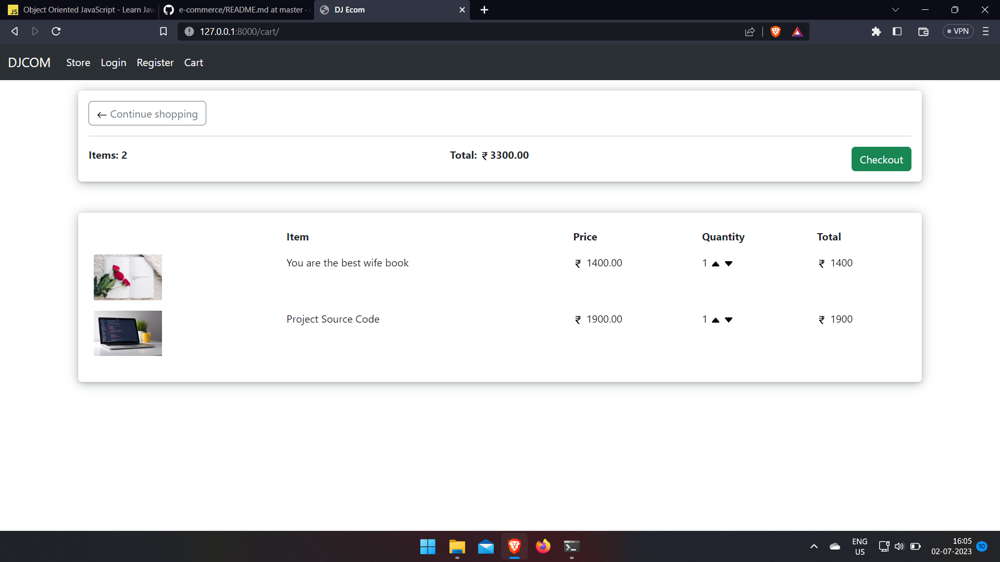
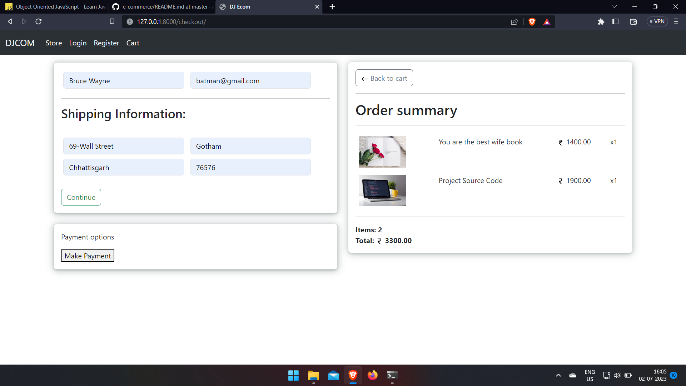
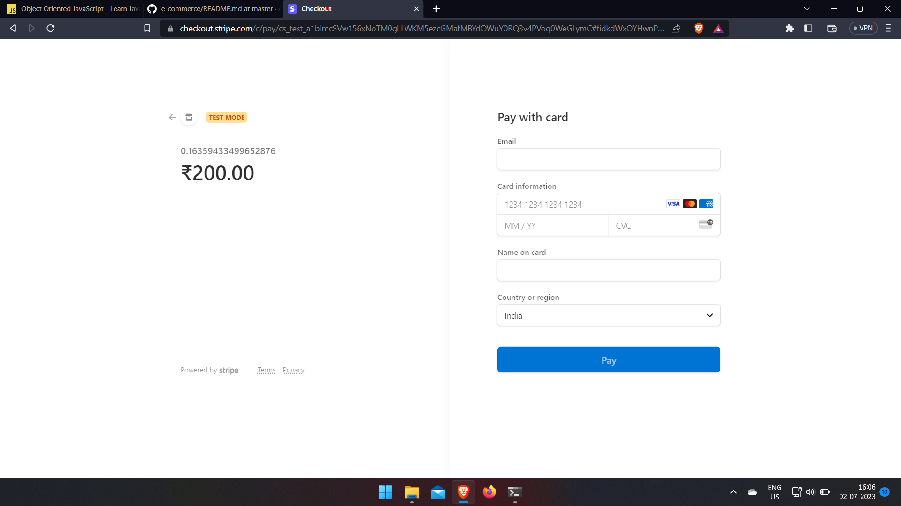

# Micro-ecommerce Web

An E-commerce website in which customers can buy products with or without login.

**Stripe** is used for payment gateway.

## Installation

Run this command in shell/cmd.

```bash
  pip install -r requirements.txt
  python manage.py runserver
```

## Screenshots

### Home Page


### Cart Page



### Checkout Page



### Stripe Payment Page


